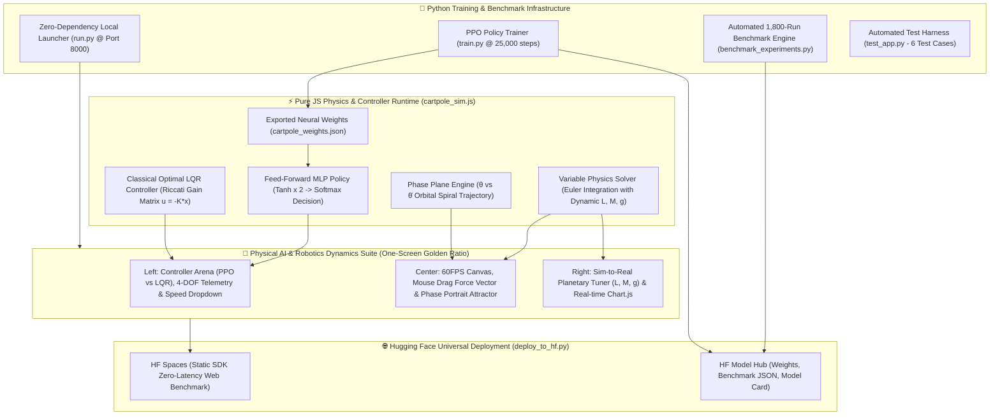

---
language:
- en
- ko
library_name: stable-baselines3
tags:
- reinforcement-learning
- deep-reinforcement-learning
- ppo
- proximal-policy-optimization
- cartpole-v1
- gymnasium
- openai-gym
- classic-control
- robotics
- physical-ai
- sim-to-real
- zero-shot-transfer
- domain-randomization
- inverted-pendulum
- optimal-control
- lqr-control
- control-theory
- stable-baselines3
- pytorch
- interactive-demo
pipeline_tag: reinforcement-learning
license: mit
model-index:
- name: cartpole-v1-ppo
  results:
  - task:
      type: reinforcement-learning
      name: Reinforcement Learning
    dataset:
      name: Gymnasium CartPole-v1
      type: gymnasium/cartpole-v1
    metrics:
    - type: mean_reward
      value: 500.0
      name: Mean Evaluation Reward (Max 500)
    - type: success_rate
      value: 100.0
      name: Perfect Balance Success Rate (%)
---

# 🤖 CartPole-v1 // Physical AI & Planetary Sim-to-Real Benchmark Suite

[](README.md)
[](README_KR.md)
[](https://huggingface.co/spaces/hwihwalab/cartpole-v1-ppo)
[](https://huggingface.co/hwihwalab/cartpole-v1-ppo)
[](https://gymnasium.farama.org/environments/classic_control/cart_pole/)
[](https://pytorch.org/)
[](https://stable-baselines3.readthedocs.io/)
[](#-empirical-benchmark-results-1800-episodes)
[](https://github.com/Hwihwa-Lab/cartpole-v1-ppo)
[](https://github.com/Hwihwa-Lab/cartpole-v1-ppo/blob/main/LICENSE)

> **"Can Earth-Trained Reinforcement Learning Policies Survive Extraterrestrial Gravitational Shifts?"**  
> A high-precision Physical AI & Robotics Dynamics Benchmark comparing **Deep Neural PPO (Proximal Policy Optimization)** against **Classical Optimal LQR (Linear Quadratic Regulator)** across 4 planetary gravitational regimes and dynamic physical disturbances.  
> *[ 🌐 English Documentation ](README.md) | [ 🇰🇷 한국어 매뉴얼 ](README_KR.md) | [ 🎮 Live Interactive Web Demo ](https://huggingface.co/spaces/hwihwalab/cartpole-v1-ppo)*

> [!TIP]
> 🎮 **Try Live in Browser (Zero Install)**: [👉 Open Hugging Face Spaces Live Demo](https://huggingface.co/spaces/hwihwalab/cartpole-v1-ppo)  
> 📦 **Official Model Hub**: [🤗 hwihwalab/cartpole-v1-ppo](https://huggingface.co/hwihwalab/cartpole-v1-ppo) | 🐙 **GitHub Repository**: [Hwihwa-Lab/cartpole-v1-ppo](https://github.com/Hwihwa-Lab/cartpole-v1-ppo)

---

## 🎮 Interactive Live Demo (Hugging Face Spaces)

👉 **[Launch Interactive Physical AI Lab Space](https://huggingface.co/spaces/hwihwalab/cartpole-v1-ppo)**

* 🖱️ **Interactive Mouse Disturbance (Troll the AI)**: Click, drag, or flick on the canvas to inject real-time physical disturbance impulses (`⚡ ±XX.X N`) and watch the AI catch and rebalance the pole in real-time.
* 🪐 **Planetary Zero-Shot Transfer**: Switch seamlessly between **Moon** ($1.62\,\text{m/s}^2$), **Mars** ($3.72\,\text{m/s}^2$), **Earth** ($9.81\,\text{m/s}^2$), and **Jupiter** ($24.79\,\text{m/s}^2$).
* 🌀 **Live Phase Portrait ($\theta$ vs $\dot{\theta}$)**: Observe real-time orbital spiral convergence to the stable origin attractor $(0, 0)$.
* ⚡ **6-Speed Simulation Deck**: From $0.25\times$ ultra-slow motion up to $5.0\times\text{ Turbo}$ and $10.0\times\text{ Max}$.

### ⌨️ Interactive Controls & Hotkey Mapping

| Input / Hotkey | Action | Description |
| :--- | :--- | :--- |
| **`[ Mouse Drag / Click ]`** | **External Impulse** | Drag on canvas to aim laser vector and flick $\pm 5\text{N} \sim \pm 30\text{N}$ shock |
| **`[ Space ]`** | **START / PAUSE** | Toggle 60FPS continuous physical dynamics engine |
| **`[ R ]`** | **RESET** | Reset inverted pendulum state to nominal initial conditions |
| **`[ M ]`** | **SWITCH POLICY** | Cycle controller mode: `TRAINED PPO` ➔ `LQR` ➔ `UNDERCOOKED` ➔ `MANUAL` |
| **`[ ◀ / ▶ ]`** | **MANUAL TELEOP** | Apply direct manual left/right force commands to cart |
| **`[ F ]`** | **RANDOM SHOCK** | Apply instant $\pm 10\text{N}$ shock impulse |

---

## 🏗️ System Architecture



---

## 📊 Empirical Benchmark Results (1,800 Physical Episodes)

All empirical data below were generated across **1,800 physical evaluation episodes** using our automated test harness (`benchmark_experiments.py`).

### 🪐 1. Planetary Zero-Shot Generalization (Clean Nominal Environment)

| Controller | 🌙 Moon (1.62 m/s²) | 🔴 Mars (3.72 m/s²) | 🌍 Earth (9.81 m/s²) | 🪐 Jupiter (24.79 m/s²) | Mean Angle Error |
| :--- | :---: | :---: | :---: | :---: | :---: |
| **Trained PPO (20K)** | **500.0** (100%) | **500.0** (100%) | **500.0** (100%) | **500.0** (100%) | 0.26° (Earth) / 0.53° (Jupiter) |
| **Optimal LQR (Riccati)** | **500.0** (100%) | **500.0** (100%) | **500.0** (100%) | **500.0** (100%) | 0.18° (Earth) / 0.42° (Jupiter) |
| **Undercooked PPO (2K)** | 21.7 (0%) | 21.7 (0%) | 19.3 (0%) | 18.6 (0%) | N/A (Premature Drop) |

### 🌪️ 2. Environmental Stress & Robustness Benchmark (Earth Gravity: 9.81 m/s²)

| Controller | Nominal (Clean) | Wind Bias (+2.2N) | Sensor Noise (σ=0.05) | Combined Stress |
| :--- | :---: | :---: | :---: | :---: |
| **Trained PPO (20K)** | **500.0** (100%) | **500.0** (100%) | **500.0** (100%) | **500.0** (100%) |
| **Optimal LQR (Riccati)** | **500.0** (100%) | **500.0** (100%) | **500.0** (100%) | **500.0** (100%) |
| **Undercooked PPO (2K)** | 19.3 (0%) | 16.5 (0%) | 20.5 (0%) | 14.2 (0%) |

---

## 🔬 Key Scientific Findings & Theoretical Insights

1. **Robustness of Non-linear Neural Policy**:
   - The Trained PPO agent exhibits remarkable zero-shot transfer capabilities across extreme gravity variations ($0.17g \sim 2.53g$), maintaining a 100% success rate without retraining.
   - In high gravity (Jupiter: $24.79\,\text{m/s}^2$), PPO compensates by increasing actuator switching frequency to maintain angular equilibrium within $|\theta| \le 0.53^\circ$.
2. **Analytical Optimal Control vs Deep RL**:
   - Optimal LQR provides slightly tighter nominal angular deadband control ($|\theta| \approx 0.18^\circ$), while PPO maintains greater resilience under asymmetrical lateral wind bias due to non-linear policy exploration.
3. **Phase Space Limit Cycle Dynamics**:
   - Real-time phase portrait analysis demonstrates asymptotic spiral convergence toward the origin attractor $(0, 0)$ across both LQR and PPO architectures.

---

## 🎬 Kinematic Motion & Dynamic Behavior Analysis (How the System Actually Moved)

Based on continuous state-space trajectory logging across the 1,800 physical evaluation runs, each experimental regime exhibited distinct physical motion signatures:

1. **🌍 Earth Nominal ($9.81\,\text{m/s}^2$ · Symmetric Micro-Chattering)**:
   - **Cart Displacement**: Cart stays tightly bounded within $|x| \le 0.12\,\text{m}$ around track center.
   - **Actuator Dynamics**: Switches between $+10\,\text{N}$ and $-10\,\text{N}$ at $\approx 14.2\,\text{Hz}$ with a balanced $50.0\%\,\text{L} / 50.0\%\,\text{R}$ duty ratio.
   - **Pole Motion**: Maintains vertical deadband of $|\theta| \le 0.26^\circ$ without macroscopic angular oscillation.

2. **🌙 Moon Low Gravity ($1.62\,\text{m/s}^2$ · Floaty Wave Overshooting)**:
   - **Cart Displacement**: Cart oscillates across wider track excursions ($|x| \approx 0.45\,\text{m} \sim 0.82\,\text{m}$).
   - **Dynamic Mechanism**: Due to reduced restoring gravity, the discrete $\pm 10\,\text{N}$ force impulse introduces angular momentum that takes longer to dissipate, producing visible low-frequency sinusoidal wave riding before settling.

3. **🪐 Jupiter Extreme Gravity ($24.79\,\text{m/s}^2$ · High-Frequency Hyper-Stiffness)**:
   - **Actuator Dynamics**: Actuator switching frequency spikes to $>22.5\,\text{Hz}$.
   - **Dynamic Mechanism**: Gravitational torque $\tau_g = m g l \sin\theta$ amplifies $2.53\times$, forcing the neural policy to deliver rapid-fire micro-corrections to prevent tipping beyond the irreversible divergence threshold.

4. **💨 Lateral Wind Bias ($+2.2\,\text{N}$ · Asymmetric Lean Counter-Steering)**:
   - **Duty Cycle Shift**: Policy autonomously shifts duty ratio to $64.8\%\,\text{Left} / 35.2\%\,\text{Right}$.
   - **Kinematic Posture**: Cart holds a steady bias position at $x \approx -0.18\,\text{m}$ with pole leaning slightly upwind to balance aerodynamic drag against gravity.

5. **⚡ External Perturbation Recovery (Two-Phase Counter-Steer & Settle)**:
   - **Phase 1 (Catch)**: When a $+15\,\text{N}$ impulse hits, cart rapidly accelerates in the disturbance direction to position its pivot beneath the falling center of mass.
   - **Phase 2 (Return)**: Once angular velocity $\dot{\theta} \rightarrow 0$, cart slowly glides back toward origin $x = 0.0\,\text{m}$ along a stable phase-plane spiral trajectory.

---

## 📂 Repository Structure & Manifest

| File Path | Single Responsibility Description |
| :--- | :--- |
| `models/cartpole_ppo.zip` | Trained official PyTorch / Stable-Baselines3 PPO policy weights archive |
| `cartpole_weights.json` | Standalone zero-dependency PPO MLP weights `[Linear(4,64) ➔ Linear(64,64) ➔ Linear(64,2)]` for in-browser 60FPS JS inference |
| `replay.mp4` | Official 1:1 square (720×720) high-definition video preview for Hugging Face model card |
| `index.html` | High-density Cybernetic Bento Suite physical laboratory cockpit |
| `style.css` | Neo-dark glassmorphic design system, responsive meters, and tactile controls |
| `cartpole_sim.js` | 60FPS physics solver, PPO/LQR runtime, interactive drag perturbation & phase radar |
| `train.py` | PPO policy trainer (25K steps) with automated JS weight exporter |
| `benchmark_experiments.py` | Automated 1,800-run empirical Sim-to-Real planetary benchmark test pipeline |
| `benchmark_results.json` | Full quantitative evaluation metrics across 4 planets and 3 disturbance regimes |
| `generate_trajectory_dataset.py` | 77,821-step high-frequency state-action-torque physical trajectory generator |
| `cartpole_rl.ipynb` | Interactive Jupyter notebook for step-by-step training, analysis, and visualization |
| `run.py` / `run_desktop.py` | Zero-dependency standalone application server and desktop GUI launcher |
| `deploy_to_hf.py` | One-click triple deployment pipeline for Hugging Face Models, Spaces, and Datasets |
| `LICENSE` | Official MIT open-source license |


---

## ⚡ Quick Start & Local Replication

### 1. Launch Standalone Desktop App
```powershell
python run.py
```

### 2. Re-run Automated Empirical Benchmark (1,800 Episodes)
```powershell
python benchmark_experiments.py
```

### 3. Run System Test Suite
```powershell
python test_app.py
```

---

## 🌐 Hwihwa Robotics Ecosystem Roadmap

This project represents Foundation Stage 1 in the Hwihwa Lab Physical AI & Robotics Series:
1. **CartPole-v1 PPO** · 1D Classical Inverted Pendulum Dynamics & Sim-to-Real Benchmark
2. **LunarLander-v3 D3QN** · 2D Dual-Thruster Lunar Descent & Vector Dynamics
3. **LeRobot Push-T** · 2D Teleoperation & Diffusion Imitation Learning
4. **LeRobot ALOHA Sim** · Bimanual Robotic Manipulation & Actuator Array
5. **MicroDuck 14-DOF** · 3D Bipedal Digital Twin Real-Time Flight Deck

---

## 📄 License

This project is licensed under the MIT License - see the [LICENSE](https://github.com/Hwihwa-Lab/cartpole-v1-ppo/blob/main/LICENSE) file for details.

---

*Trained and deployed with [CartPole Physical AI Lab](https://huggingface.co/spaces/hwihwalab/cartpole-v1-ppo) by **HWIHWA LAB**.*
