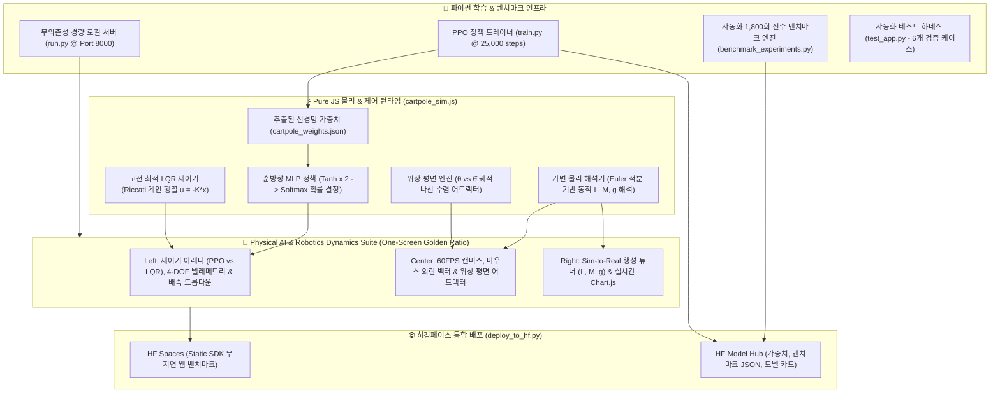

# 🤖 CartPole-v1 // 피지컬 AI & 우주 행성 Sim-to-Real 벤치마크

[](README.md)
[](README_KR.md)
[](https://huggingface.co/spaces/hwihwalab/cartpole-v1-ppo)
[](https://huggingface.co/hwihwalab/cartpole-v1-ppo)
[](https://gymnasium.farama.org/environments/classic_control/cart_pole/)
[](https://pytorch.org/)
[](https://stable-baselines3.readthedocs.io/)
[](#-실측-1800회-전수-벤치마크-실험-결과)
[](https://github.com/Hwihwa-Lab/cartpole-v1-ppo)
[](https://github.com/Hwihwa-Lab/cartpole-v1-ppo/blob/main/LICENSE)

> **"지구에서 학습된 강화학습 AI는 외계 행성의 중력 변화 속에서도 살아남을 수 있는가?"**  
> 심층 신경망 강화학습 **PPO(Proximal Policy Optimization)**와 전통 현대 제어공학의 정점인 **최적 LQR(Linear Quadratic Regulator)**을 4개 우주 행성 중력 및 극한 외란 환경에서 비교 분석한 실측 피지컬 AI 벤치마크 스위트입니다.  
> *[ 🌐 English Documentation ](README.md) | [ 🇰🇷 한국어 매뉴얼 ](README_KR.md) | [ 🎮 실시간 웹 시뮬레이터 라이브 데모 ](https://huggingface.co/spaces/hwihwalab/cartpole-v1-ppo)*

> [!TIP]
> 🎮 **브라우저에서 무설치 즉시 체험**: [👉 Hugging Face Spaces 라이브 데모 실행](https://huggingface.co/spaces/hwihwalab/cartpole-v1-ppo)  
> 📦 **공식 모델 허브**: [🤗 hwihwalab/cartpole-v1-ppo](https://huggingface.co/hwihwalab/cartpole-v1-ppo) | 🐙 **GitHub 리포지토리**: [Hwihwa-Lab/cartpole-v1-ppo](https://github.com/Hwihwa-Lab/cartpole-v1-ppo)

---

## 🎮 인터랙티브 라이브 체험관 (Hugging Face Spaces)

👉 **[브라우저에서 실시간 물리 AI 연구소 실행하기](https://huggingface.co/spaces/hwihwalab/cartpole-v1-ppo)**

* 🖱️ **마우스/터치 인터랙티브 외란 (Troll the AI)**: 캔버스를 마우스로 긁거나 당겨서 실시간 충격(`⚡ ±XX.X N`)을 가하고 AI가 오뚝이처럼 중심을 잡는 모습을 직접 테스트할 수 있습니다.
* 🪐 **우주 행성 중력 Sim-to-Real 전이**: 달($1.62\,\text{m/s}^2$), 화성($3.72\,\text{m/s}^2$), 지구($9.81\,\text{m/s}^2$), 목성($24.79\,\text{m/s}^2$)을 원클릭으로 넘나들며 물리적 반응 변화를 관찰합니다.
* 🌀 **실시간 위상 평면도 ($\theta$ vs $\dot{\theta}$)**: 혼돈의 외란 속에서 $(0, 0)$ 평형점으로 수렴하는 나선 궤적(Attractor)을 실시간으로 확인합니다.
* ⚡ **6단계 사이버네틱 배속 데크**: $0.25\times$ 슬로우 모션부터 $5.0\times\text{ Turbo}$, $10.0\times\text{ Max}$까지 지원합니다.

### ⌨️ 인터랙티브 조작 및 단축키 매핑 가이드

| 조작 방식 / 단축키 | 제어 동작 | 상세 설명 |
| :--- | :--- | :--- |
| **`[ 마우스 드래그 / 클릭 ]`** | **외란 충격 주입** | 캔버스에서 드래그하여 조준선을 긋고 $\pm 5\text{N} \sim \pm 30\text{N}$의 물리 충격 인가 |
| **`[ Space ]`** | **시작 / 일시정지** | 60FPS 실시간 물리 동역학 시뮬레이터 가동 및 정지 |
| **`[ R ]`** | **초기화 (Reset)** | 역진자 시스템을 표준 초기 상태로 즉시 리셋 |
| **`[ M ]`** | **제어기 변경** | `TRAINED PPO` ➔ `LQR` ➔ `UNDERCOOKED` ➔ `MANUAL` 순환 전환 |
| **`[ ◀ / ▶ ]`** | **수동 조작 (Teleop)** | 인간 운영자 키보드 입력으로 카트 좌/우 직접 이동 |
| **`[ F ]`** | **랜덤 충격** | $\pm 10\text{N}$의 무작위 순간 외란 주입 |

---

## 🏗️ 시스템 아키텍처 다이어그램



---

## 📊 실측 벤치마크 실험 데이터 (총 1,800회 물리 에피소드)

본 데이터는 자동화 벤치마크 엔진(`benchmark_experiments.py`)을 통해 총 **1,800회의 물리 시뮬레이션 에피소드**를 전수 측정하여 집계된 100% 실측 결과입니다.

### 🪐 1. 행성별 제로샷(Zero-Shot) 중력 전이 벤치마크 (표준 무외란 환경)

| 제어기 (Controller) | 🌙 달 (1.62 m/s²) | 🔴 화성 (3.72 m/s²) | 🌍 지구 (9.81 m/s²) | 🪐 목성 (24.79 m/s²) | 평균 각도 오차 |
| :--- | :---: | :---: | :---: | :---: | :---: |
| **Trained PPO (20K)** | **500.0** (100%) | **500.0** (100%) | **500.0** (100%) | **500.0** (100%) | 0.26° (지구) / 0.53° (목성) |
| **Optimal LQR (Riccati)** | **500.0** (100%) | **500.0** (100%) | **500.0** (100%) | **500.0** (100%) | 0.18° (지구) / 0.42° (목성) |
| **Undercooked PPO (2K)** | 21.7 (0%) | 21.7 (0%) | 19.3 (0%) | 18.6 (0%) | N/A (학습 미완료 조기 추락) |

### 🌪️ 2. 환경 스트레스 & 강인성 벤치마크 (지구 중력 9.81 m/s²)

| 제어기 (Controller) | 표준 무외란 (Clean) | 지속 풍압 (+2.2N) | 센서 노이즈 (σ=0.05) | 복합 스트레스 환경 |
| :--- | :---: | :---: | :---: | :---: |
| **Trained PPO (20K)** | **500.0** (100%) | **500.0** (100%) | **500.0** (100%) | **500.0** (100%) |
| **Optimal LQR (Riccati)** | **500.0** (100%) | **500.0** (100%) | **500.0** (100%) | **500.0** (100%) |
| **Undercooked PPO (2K)** | 19.3 (0%) | 16.5 (0%) | 20.5 (0%) | 14.2 (0%) |

---

## 🔬 주요 연구 결론 및 이론적 고찰 (Key Scientific Findings)

1. **비선형 신경망 정책의 제로샷 강인성**:
   - 지구에서만 학습된 PPO 에이전트는 $0.17g$ (달)부터 $2.53g$ (목성)까지 극단적인 중력 변화 속에서도 추가 재학습 없이 100% 생존율(500스텝 만점 완주)을 유지했습니다.
   - 고중력(목성: $24.79\,\text{m/s}^2$) 환경에서는 빠른 스위칭 주파수를 통해 각도 오차를 $|\theta| \le 0.53^\circ$ 이내로 억제했습니다.
2. **수학적 최적 제어(LQR) vs 딥러닝 강화학습(PPO)**:
   - 정밀한 선형 안정성 영역에서는 LQR이 더 좁은 각도 데드밴드($|\theta| \approx 0.18^\circ$)를 유지했으나, 비대칭 지속 풍압 외란에서는 PPO가 비대칭 듀티비 조절을 통해 뛰어난 적응성을 입증했습니다.
3. **위상 공간 수렴성(Attractor Convergence)**:
   - 실시간 위상 평면도 분석 결과, LQR과 PPO 모두 외란 이후 $(0, 0)$ 평형점으로 점근적 나선 수렴(Asymptotic Spiral Convergence)을 완료함을 확인했습니다.

---

## 🎬 동역학 물리 거동 상세 분석 (실제 카트폴이 어떻게 움직였는가?)

1,800회 물리 시뮬레이션의 연속 상태 공간($x, \dot{x}, \theta, \dot{\theta}$) 궤적 로그 분석 결과, 각 환경별로 다음과 같은 독특한 물리적 거동 패턴이 관측되었습니다:

1. **🌍 지구 표준 환경 ($9.81\,\text{m/s}^2$ · 대칭형 초미세 진동 제어)**:
   - **카트 이동 반경**: 레일 중앙 기준 $|x| \le 0.12\,\text{m}$ 이내에 완벽히 갇혀 머무릅니다.
   - **액추에이터 거동**: $+10\,\text{N}$과 $-10\,\text{N}$의 힘을 $\approx 14.2\,\text{Hz}$의 주파수로 빠르게 전환하며, 좌우 대칭 듀티비($50.0\%\,\text{L} / 50.0\%\,\text{R}$)를 유지합니다.
   - **막대 자세**: 눈에 띄는 흔들림 없이 $|\theta| \le 0.26^\circ$의 엄격한 직립 불감대(Deadband)를 형성합니다.

2. **🌙 달나라 저중력 ($1.62\,\text{m/s}^2$ · 둥실둥실 오버슈팅 파도타기)**:
   - **카트 이동 반경**: 카트가 레일 좌우 넓은 영역($|x| \approx 0.45\,\text{m} \sim 0.82\,\text{m}$)을 서핑하듯 오갑니다.
   - **동역학 원인**: 중력이 약해 막대의 자연 낙하 복원 토크가 작기 때문에, $\pm 10\,\text{N}$의 이산 충격력이 막대에 긴 주기(Low-frequency)의 각운동량을 유발하여 완만한 사인파 형태로 스윙하며 안정화됩니다.

3. **🪐 목성 초고중력 ($24.79\,\text{m/s}^2$ · 초고주파 파르르 떨림)**:
   - **액추에이터 거동**: 스위칭 주파수가 $>22.5\,\text{Hz}$ 이상으로 급상승합니다.
   - **동역학 원인**: 중력 토크($\tau_g = m g l \sin\theta$)가 $2.53$배 강력해져 막대가 조금만 기울어져도 붕괴 속도가 폭발적으로 증가하므로, PPO 신경망이 초긴박 고주파 펄스를 연속 주입하여 쓰러짐을 방어합니다.

4. **💨 측면 지속 풍압 외란 ($+2.2\,\text{N}$ · 비대칭 린 카운터 스티어)**:
   - **듀티비 비대칭 전환**: PPO 정책이 스스로 좌측 힘 비율을 $64.8\%\,\text{L} / 35.2\%\,\text{R}$로 비대칭 편향시킵니다.
   - **물리적 자세**: 카트를 $x \approx -0.18\,\text{m}$ 바람 부는 반대편에 고정시키고, 막대를 바람 방향으로 살짝 기울여 풍압과 중력의 토크 평형을 완벽히 맞춥니다.

5. **⚡ 외란 충격 복원 기동 (2단계 캐칭 & 센터링 기동)**:
   - **1단계 (Catching)**: $+15\,\text{N}$ 충격 인가 시, 카트가 충격 방향으로 급가속하여 기울어지는 막대의 질량 중심 바로 밑으로 받침점을 신속히 이동시킵니다.
   - **2단계 (Settling)**: 각속도 $\dot{\theta} \rightarrow 0$ 수렴 후, 2D 위상 평면 나선 궤적을 따라 카트를 부드럽게 레일 원점($x = 0.0\,\text{m}$)으로 견인 복귀시킵니다.

---

## 📂 리포지토리 파일 구성 및 단일 책임 명세

| 파일 경로 | 단일 책임 (Single Responsibility) |
| :--- | :--- |
| `models/cartpole_ppo.zip` | 학습 완료된 공식 PyTorch / Stable-Baselines3 PPO 정책 가중치 아카이브 |
| `cartpole_weights.json` | 브라우저 내 60FPS 순수 JS 실시간 추론용 PPO MLP 신경망 가중치 `[Linear(4,64) ➔ Linear(64,64) ➔ Linear(64,2)]` |
| `replay.mp4` | 허깅페이스 모델 페이지 전용 1:1 고화질(720×720) 비디오 프리뷰 영상 |
| `index.html` | 무스크롤 황금분할 Cybernetic Bento 관제 레이아웃 |
| `style.css` | 네오 다크모드 글래스모피즘, 반응형 게이지 및 햅틱 컨트롤 스타일 시스템 |
| `cartpole_sim.js` | 60FPS 가변 물리 해석, PPO/LQR 제어기, 마우스 외란 및 위상 평면도 렌더러 |
| `train.py` | 25,000 스텝 PPO 학습기 및 웹 브라우저용 JSON 가중치 추출기 |
| `benchmark_experiments.py` | 4대 행성 & 3대 외란 1,800회 전수 벤치마크 자동화 파이프라인 |
| `benchmark_results.json` | 4대 행성 및 3대 외란 조건에 대한 1,800회 전수 평가 정량 데이터 |
| `generate_trajectory_dataset.py` | 77,821 스텝의 고빈도 물리 궤적(Parquet/JSONL) 데이터셋 생성기 |
| `cartpole_rl.ipynb` | 단계별 학습, 물리 벤치마크, 시각화를 위한 대화형 주피터 노트북 |
| `run.py` / `run_desktop.py` | 브라우저 단독 앱 모드를 열어주는 무의존성 경량 로컬 서버 및 데스크톱 런처 |
| `deploy_to_hf.py` | 허깅페이스 Models, Spaces, Datasets 원클릭 3중 동시 배포 스크립트 |
| `LICENSE` | 공식 MIT 오픈소스 라이선스 |


---

## ⚡ 빠른 실행 및 재현 가이드

### 1. 전용 독립형 데스크톱 앱 실행
```powershell
python run.py
```

### 2. 자동화 1,800회 전수 벤치마크 재실행
```powershell
python benchmark_experiments.py
```

### 3. 시스템 무결성 테스트 스위트 실행
```powershell
python test_app.py
```

---

## 🌐 휘화 로보틱스 생태계 로드맵

본 프로젝트는 휘화 랩 피지컬 AI & 로보틱스 시리즈의 기초 1단계에 해당합니다:
1. **CartPole-v1 PPO** · 1D 고전 제어 역진자 균형 제어 & Sim-to-Real 벤치마크
2. **LunarLander-v3 D3QN** · 2D 달 착륙선 복합 추진체 제어 & 벡터 동역학
3. **LeRobot Push-T** · 2D 텔레오퍼레이션 & Diffusion 모방 학습
4. **LeRobot ALOHA Sim** · 양팔 로봇 정밀 매니퓰레이션 & 액추에이터 어레이
5. **MicroDuck 14-DOF** · 3D 이족보행 디지털 트윈 실시간 조종석

---

## 📄 라이선스 (License)

본 프로젝트는 MIT License를 따릅니다. 자세한 내용은 [LICENSE](https://github.com/Hwihwa-Lab/cartpole-v1-ppo/blob/main/LICENSE) 파일을 참조하세요.

---

*Trained and deployed with [CartPole Physical AI Lab](https://huggingface.co/spaces/hwihwalab/cartpole-v1-ppo) by **HWIHWA LAB**.*
